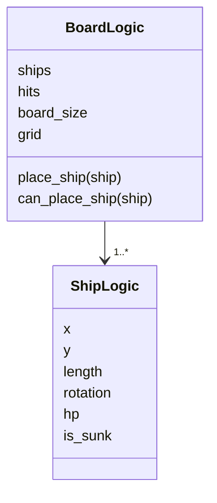
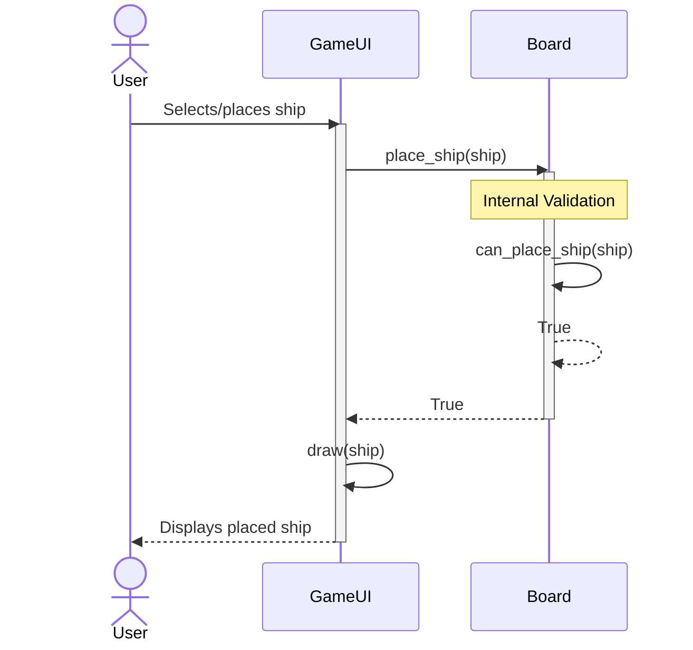

### Alustava luokkakaavio:

```mermaid
classDiagram
    class BoardLogic {
        ships
        hits
        board_size
        grid
        place_ship(ship)
        can_place_ship(ship)
    }

    class ShipLogic {
        x
        y
        length
        rotation
        hp
        is_sunk
    }

    BoardLogic --> "1..*" ShipLogic
```

### Sekvenssikaavio laivojen asettelulle:

```mermaid
sequenceDiagram
    actor U as User
    participant UI as GameUI
    participant B as Board

    U->>UI: Selects/places ship
    activate UI
    UI->>B: place_ship(ship)
    activate B
    
    Note over B: Internal Validation
    B->>B: can_place_ship(ship)
    B-->>B: True
    
    B-->>UI: True
    deactivate B

    UI->>UI: draw(ship)
    UI-->>U: Displays placed ship
    deactivate UI
```
