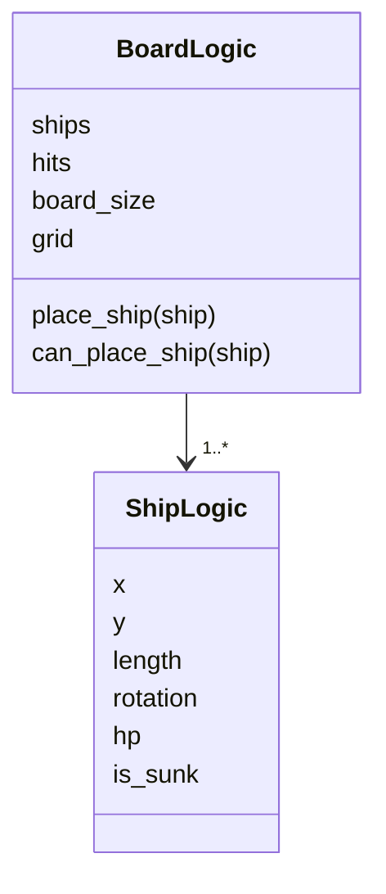

### Alustava luokkakaavio:

```mermaid
classDiagram
    class BoardLogic {
        ships
        hits
        board_size
        grid
        place_ship(ship)
        can_place_ship(ship)
    }

    class ShipLogic {
        x
        y
        length
        rotation
        hp
        is_sunk
    }

    BoardLogic --> "1..*" ShipLogic
```